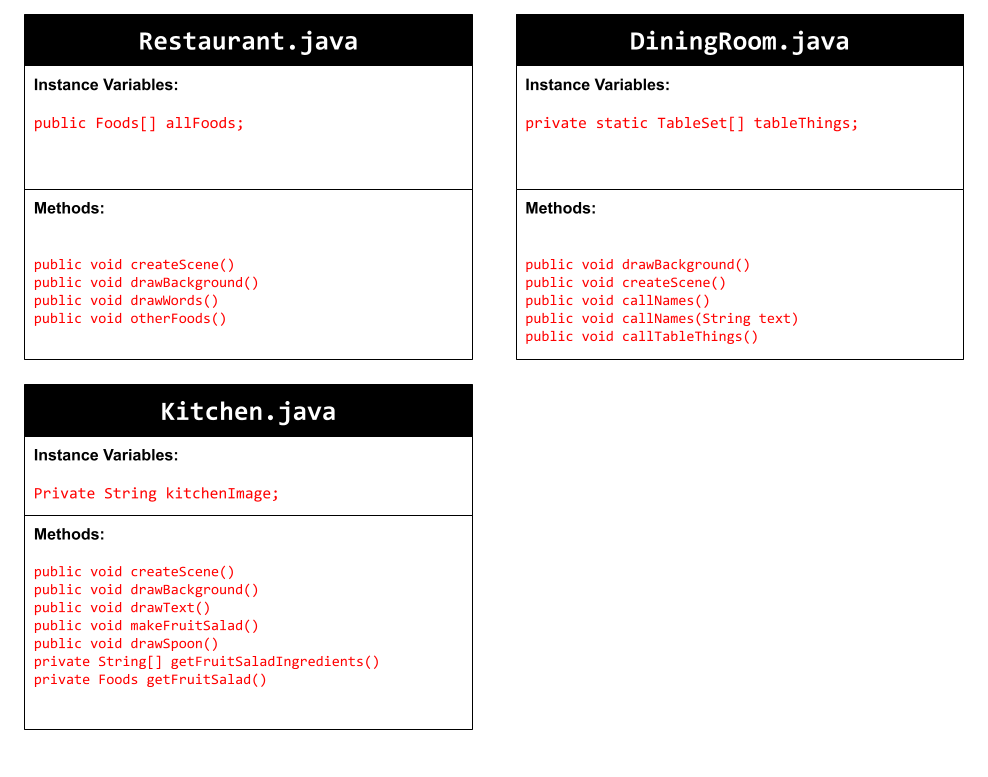
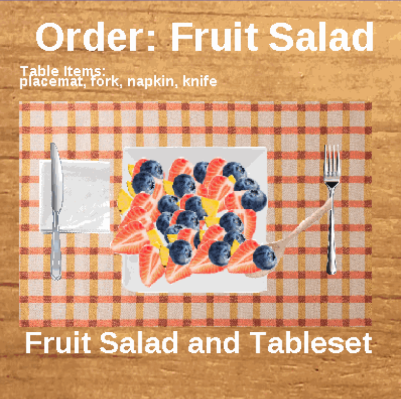

# Unit 7 - Creative Animation with The Theater Project

## Introduction

For this project, you will create an animation using The Theater that portrays a personal interest or solves a problem that you choose. Your program should demonstrate the object-oriented programming and software engineering skills and knowledge you have developed throughout the year.

## Requirements

Use your knowledge of object-oriented programming, data structures, and algorithms to create an animation using The Theater:

- **Use inheritance and polymorphism** – Create a superclass that represents shared attributes and behaviors with at least two subclasses that are more specific versions or variations of the superclass.
- **Method decomposition** – Use overloaded, overridden, and private methods to implement different versions of the same behavior, variations of a superclass behavior, and to improve code organization.
- **Use at least two data structures** - Use at least two 1D or 2D arrays or ArrayLists to store elements that are manipulated using loops and conditionals.
- **Implement one or more algorithms** – Implement one or more algorithms that use loops and two-way or multi-selection statements with compound Boolean expressions to analyze the data.
- **Create a visualization** – Create an animation that portrays a personal interest or solves a problem that you choose using objects, data structures, and methods.
- **Document your code** – Use comments to explain the purpose of the methods and code segments and note any preconditions and postconditions.

## Trello Board

[My Trello planning board](https://trello.com/b/PIfguRbU/my-trello-board)

## UML Diagram

## Video

## Project Description

Write a description of the personal interest or problem that your animation addresses. Then explain the user story(s) you identified, and how they help frame making your animation.

In this creative animation project, a program is used to illustrate the process of fully preparing the food item, fruit salad, in a restaurant. This animation addresses our affinity for fruits and preparing food. As three different scenes are created to represent different steps in the food preparation process, users can learn how to make fruit salad and the steps needed to be able to present the dish to a customer. For example, the first scene puts together a fruit salad from pieces of pineapples, strawberries, and blueberries while the second and third scene show how the table should be set for the customer. To carry out this program, multiple different methods involving different decompositions, data structures, and visualizations to draw out each part of each scene. Additionally, for-loops and if-statements were used to iterate thorugh data and display specific pieces. Essentially, our animation allows users to learn about how to prepare food, such as a fruit salad, from the kitchen all the way to a customer in a restaurant setting. 
